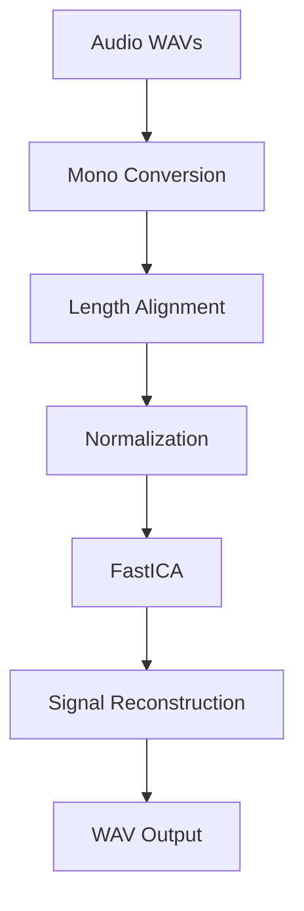

# 🎧 Audio Source Separation using Independent Component Analysis (ICA)


---

## 📌 Overview

This project implements **Blind Source Separation (BSS)** using **Independent Component Analysis (ICA)** to solve the *Cocktail Party Problem* — separating mixed audio signals into original independent sources.

We assume:
\[
X = A S
\]
and estimate \( S \) without knowing \( A \).

---

## ⚙️ Pipeline


## 🚀 Features

- Stereo → mono conversion  
- Signal normalization  
- FastICA decomposition  
- Deterministic output (random_state=42)  
- int16 WAV reconstruction  
- Pytest test suite
## 🧠 How It Works

The system separates mixed audio signals using **Independent Component Analysis (ICA)**, which assumes that observed signals are linear mixtures of statistically independent sources.

### Steps:

1. 🎙 Load audio files  
2. 🎚 Convert stereo → mono  
3. 📏 Match signal lengths  
4. 📊 Normalize signals  
5. 🧠 Apply FastICA  
6. 🔊 Reconstruct separated sources  
7. 💾 Save as WAV files  

---

## 📦 Installation

```bash
git clone https://github.com/NinaAmini/Source_Separation_Using_ICA
cd DSP_Project/Source_separation_Using_ICA
```

---

## 📌 Requirements

```txt
numpy
scipy
scikit-learn
pytest
```

Install dependencies:

```bash
pip install -r requirements.txt
```

---

## ▶️ Usage

```bash
python cocktail_party.py
```

### Input files:
- m2-2-1.wav  
- m2-2-2.wav  

### Output files:
- separated_1.wav  
- separated_2.wav  

---

## 🧪 Testing

```bash
pytest -v
```
